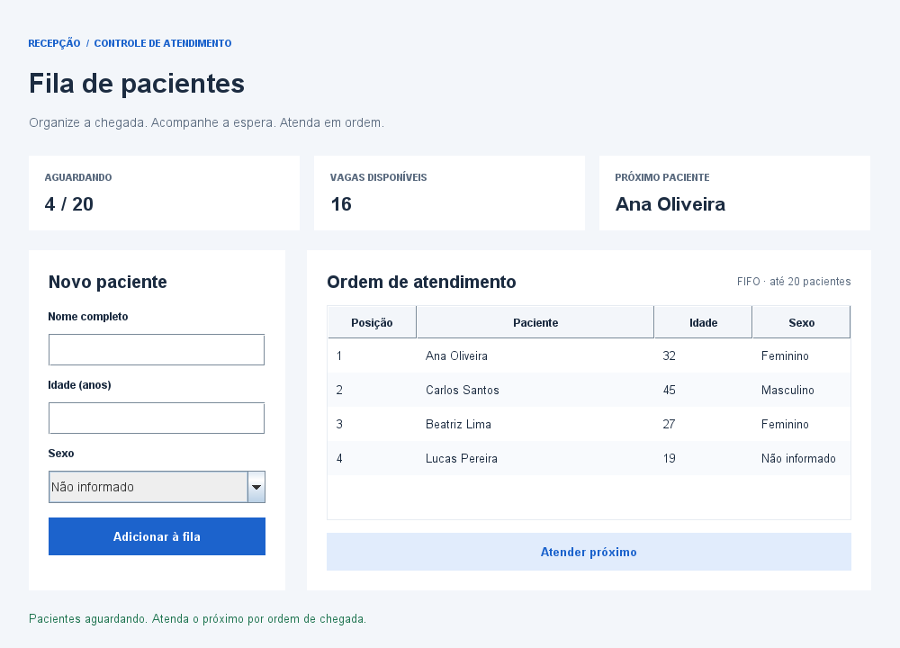
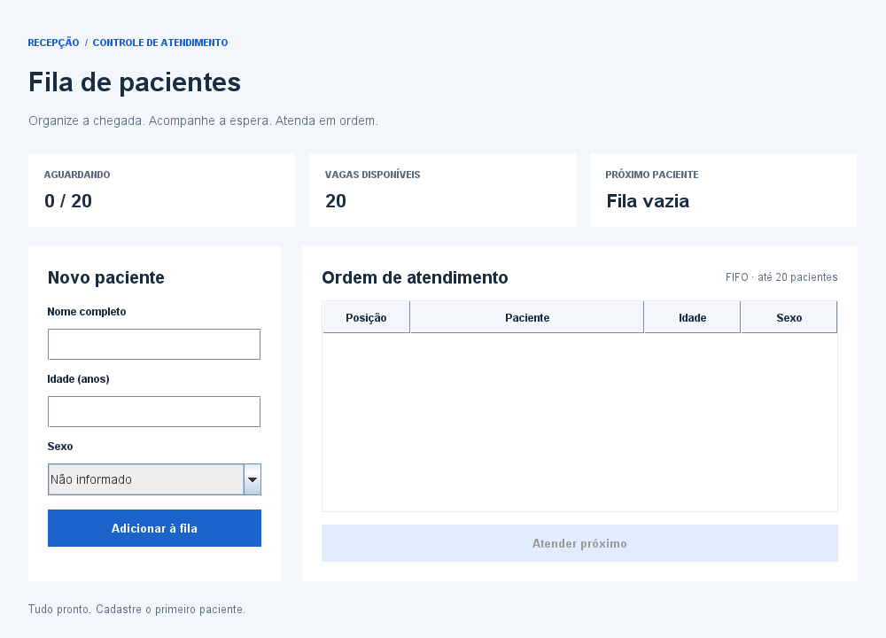

# Fila de pacientes

Aplicação desktop em **Java Swing** para cadastrar pacientes e organizar o atendimento por ordem de chegada. Um mini projeto de estruturas de dados com uma fila circular de capacidade fixa, interface em português e nenhuma biblioteca externa.

## Capturas de tela

### Pacientes aguardando atendimento



### Estado inicial




## Funcionalidades

- Cadastro com nome, idade e sexo, incluindo a opção “Não informado”.
- Validação de nome obrigatório (até 100 caracteres) e idade inteira entre 0 e 130 anos.
- Atendimento FIFO (*First In, First Out*): o primeiro a chegar é o primeiro atendido.
- Até 20 pacientes aguardando, com reutilização das vagas após cada atendimento.
- Indicadores de ocupação, vagas disponíveis e próximo paciente.
- Tabela protegida contra edição e atualizada a cada operação.
- Mensagens de validação na própria tela, preservando os campos quando há erro.

## Requisitos

- **JDK 8 ou superior**, com `java`, `javac` e `jar` no `PATH`, ou `JAVA_HOME` apontando para o JDK.
- Windows com PowerShell para os scripts abaixo.
- Ambiente gráfico para abrir a janela. Os testes e as capturas funcionam sem monitor.

O JRE sozinho permite executar um JAR já compilado, mas não compilar o projeto.

## Compilar e executar

Na raiz do repositório:

```powershell
# Compila e gera FilaPacientes/dist/FilaPacientes.jar
./scripts/build.ps1

# Compila e abre a aplicação
./scripts/build.ps1 -Run

# Executa o JAR após a compilação
java -jar FilaPacientes/dist/FilaPacientes.jar
```

Se o PowerShell bloquear scripts, use a opção apenas para o processo atual:

```powershell
powershell -ExecutionPolicy Bypass -File ./scripts/build.ps1 -Run
```


### Compilação manual (Linux/macOS)

```sh
mkdir -p FilaPacientes/build/classes FilaPacientes/dist
find FilaPacientes/src -name '*.java' > FilaPacientes/build/sources.txt
javac -encoding UTF-8 -source 8 -target 8 -d FilaPacientes/build/classes @FilaPacientes/build/sources.txt
jar cfe FilaPacientes/dist/FilaPacientes.jar filapacientes.Menu -C FilaPacientes/build/classes .
java -jar FilaPacientes/dist/FilaPacientes.jar
```

## Como usar

1. Preencha o nome e a idade; selecione o sexo ou mantenha “Não informado”.
2. Clique em **Adicionar à fila**. Enter no campo idade também cadastra o paciente.
3. Acompanhe os pacientes na tabela, em ordem de chegada.
4. Clique em **Atender próximo** para retirar o primeiro paciente e liberar uma vaga.

Com a fila vazia, o atendimento fica desabilitado. Quando as 20 vagas estão ocupadas, o cadastro fica desabilitado até um atendimento liberar espaço.

## Estrutura

```text
fila_pacientes/
├── README.md
├── docs/screenshots/             # Capturas da interface
├── scripts/build.ps1             # Compilação, execução, testes e capturas
└── FilaPacientes/
    ├── src/filapacientes/
    │   ├── Menu.java             # Inicialização e tema
    │   ├── Paciente.java         # Dados imutáveis e validação
    │   ├── Fila.java             # Estrutura circular FIFO
    │   └── ui/PainelFila.java    # Formulário, tabela e ações
    ├── test/filapacientes/
    │   ├── Testes.java           # Testes de domínio e interface
    │   └── Capturas.java         # Renderização reproduzível das imagens
    ├── nbproject/                # Configuração compartilhada do NetBeans
    ├── build.xml                 # Build Ant do NetBeans
    └── manifest.mf
```

`build/`, `dist/`, configurações privadas da IDE e logs são artefatos locais ignorados pelo Git.

## Estrutura de dados e melhorias

A fila utiliza um vetor, um índice de início e uma contagem de pacientes. Inserção e remoção custam **O(1)**; a listagem custa **O(n)**. O índice avança circularmente com o operador de módulo, permitindo reutilizar as posições liberadas sem deslocar os elementos.


## Escopo

Os dados ficam apenas na memória e são perdidos ao fechar a aplicação. Este é um projeto didático: não implementa persistência, autenticação ou classificação de risco clínico. O atendimento segue exclusivamente a ordem de chegada.
